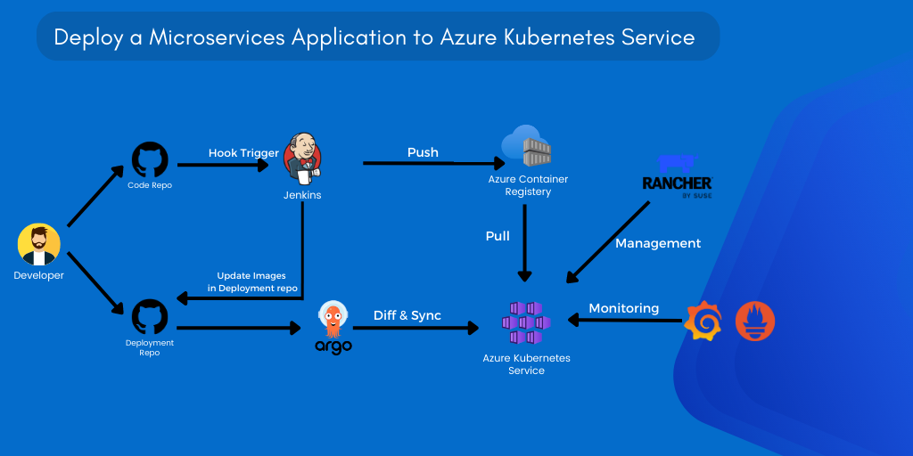

# Deploy a Microservices Application to Azure Kubernetes Service

This project is an example of how to automate the deployment of a microservices application to Azure Kubernetes Service using Jenkins for Continuous Integration and publishing the create container images to Azure ACR. It also uses ArgoCD for Continuous Delivery, Prometheus and Grafana for monitoring, and Rancher to manage the AKS cluster.

## Description
This project demonstrates how to use Jenkins, ArgoCD to automate the deployment of a microservices application to AKS (Azure Kubernetes Service) . The application source code is stored in one repository, and the Helm files used by ArgoCD are stored in another repository. The project includes Prometheus and Grafana for monitoring the application.

## Architecture Diagram
The architecture diagram above shows the different components of the project and how they interact with each other.

## Technologies Used
The technologies and tools used in this project include:

- Jenkins
- Azure AKS
- Azure ACR
- ArgoCD
- Prometheus
- Grafana
- Rancher
- Kubernetes
- Helm

## Contributing
If you would like to contribute to this project, please follow these guidelines:

- Create a new branch for your changes.
- Make your changes and commit them to your branch.
- Submit a pull request with your changes.